# 预训练工作整理

## 纯文本

1. **GPT系列**

   GPT-1(2018) 

   采用transformer decoder做语言模型，预训练阶段采用无监督数据，微调阶段引入一个线性输出层做下游任务，不同下游任务会采取不同的输入形式，微调阶段采用有监督数据。

   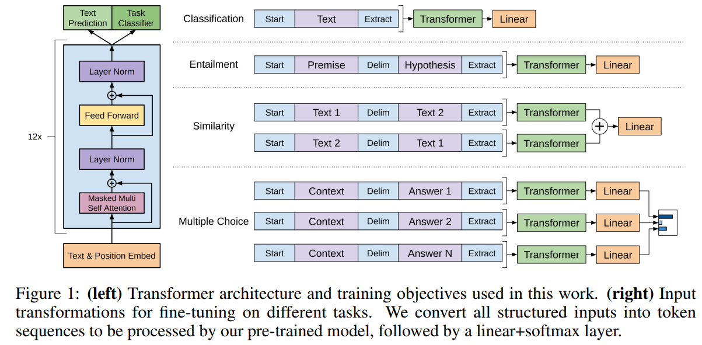

   

   GPT-2 (2019)

   采用和GPT-1相似的结构，更大的数据规模做预训练，不finetune，直接测试多种**生成式下游任务**

   

2. **RoBERTa (2019)**  

   更多数据，更大batch, 更长训练时间，不用NSP任务，更长的序列，动态mask， byte level BPE

   

## 纯视觉

1. **BEiT (2021)**

   首先按照DALLE的方式学习一个image tokenizer将图片映射成token序列，在预训练阶段，输入image patches, 不同于**ViT用线性层对每个patch进行映射成一个特征**，这里**每个patch内保持原始pixel信息**，预训练任务为预测mask的图像区域对应的token。

   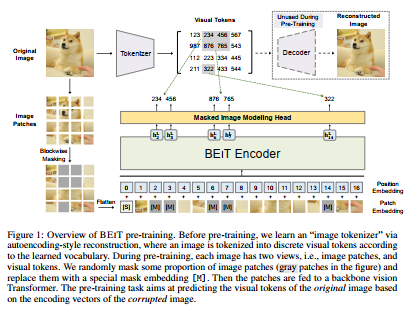

2. 

## 多模态 (整体按照时间序列排序，紧密相关的工作会放一起)

1. **LXMERT (EMNLP 2019)**

   双流+单流模型，独特设计的cross-modality encoder，每一层有一个cross-attention和self-attention

   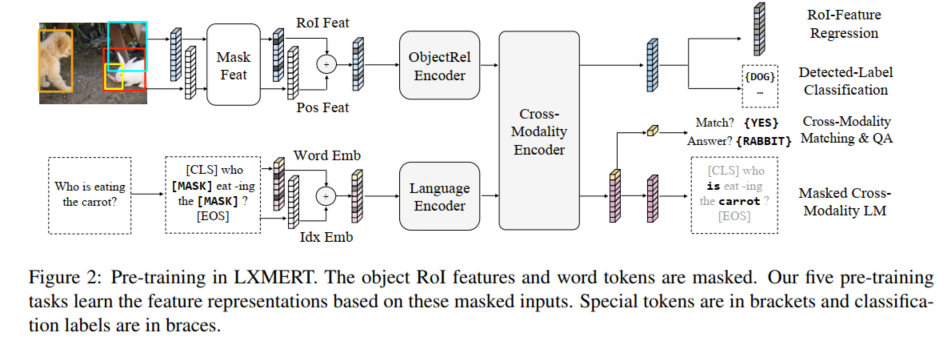

2. **ViLBERT (NIPS 2019)**

   双流+单流模型，也设计了一种co-attention transformer layer, 三个预训练任务：预测词，预测视觉特征的对象类别分布，图文是否匹配 (各取图像部分的一个特殊token和文本部分的特殊token<CLS>做对应元素乘积，然后加一个分类层做二分类)

   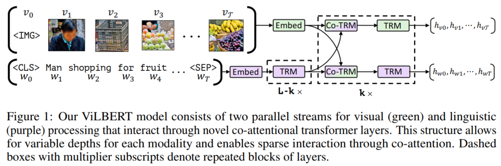

3. **VLBERT (ICLR 2020)**

   单流模型，两个预训练任务：预测词（MLM）以及预测视觉ROI特征的对象类别

   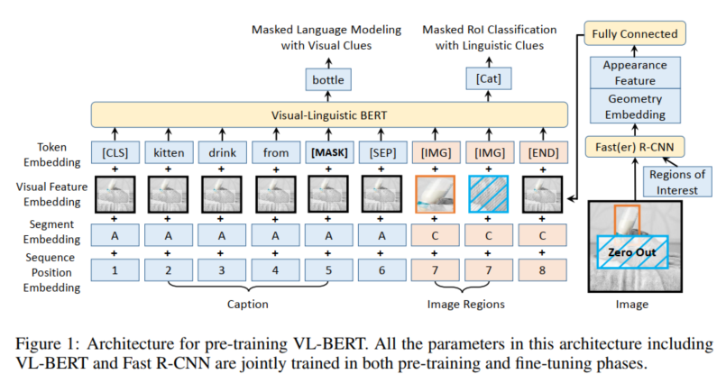

4. **UNITER (ECCV 2020)**

   单流模型，四个预训练任务：预测词（MLM），预测特征（MRM），图文匹配（ITM）以及词和对象特征的匹配（WRA）

   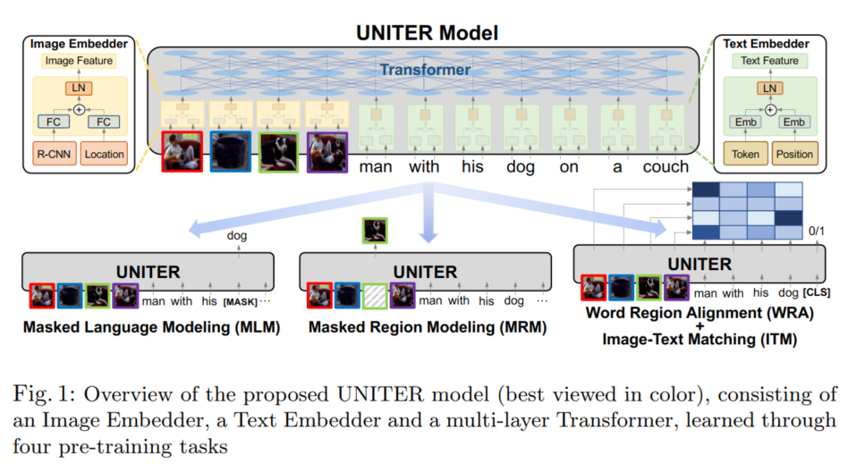

5. **Unified VLP (AAAI 2020)**

   单流模型，为captioning和VQA设计，只做生成。两个预训练任务：根据视觉和**所有文本**预测当前词，根据视觉和**前面的文本**预测当前词。finetune阶段，直接在**每一步使用mask预测当前词**。

   

   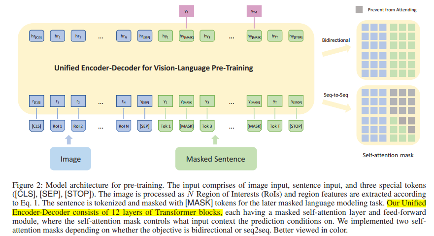

   

6. **OSCAR (ECCV 2020)**

   单流模型，引入对象类别作为输入，两个预训练任务：预测词（word或object tags都有可能）以及判断是否匹配（负例来自于替换object tags）；做caption finetune时，和Unified VLP一样，不用额外的decoder，直接在**每一步使用mask预测当前词**。

   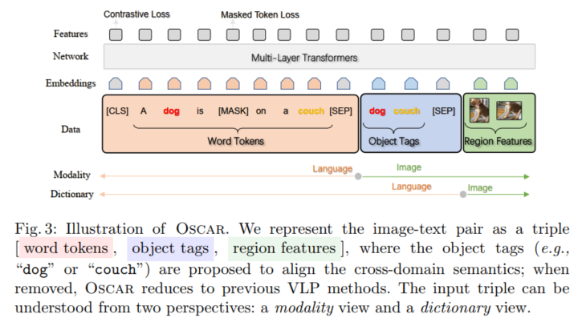

   

   

7. **XGPT (NLPCC 2021)**

   针对caption的编码器-解码器结构，预训练用了四个任务：1）一般的caption生成任务；2）编码器输入图像信息和包含mask的句子，解码器还原mask的词组；3）编码器输入图文attention之后的特征，解码器还原整个句子；4）编码器输入句子，解码器生成图像特征。本文发现使用解码器比只用编码做caption更好，并且解码器和编码共享参数更好。

   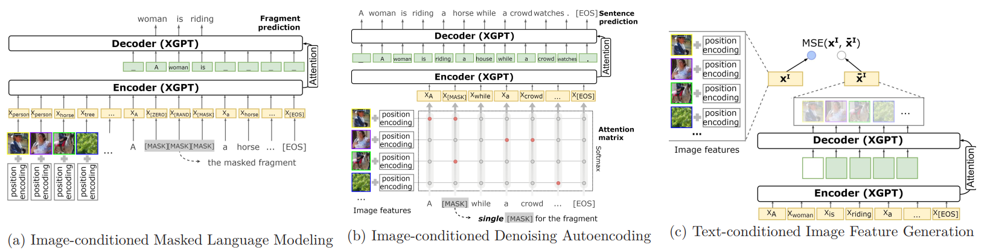

8. **VinVL (CVPR 2021)**

   大部分VL模型使用的图像特征仍然停留在bottom-up (CVPR 2018) （训练于Visual Genome）， 本文认为图像特征对于VL很重要，因此结合多个对象数据集（COCO，OpenImagesV5，Objects365V1， Visual Genome）重新训练了一个对象识别模型用于抽取视觉特征。在该特征的基础上，改进OSCAR（更多样的训练数据以及额外的负例构建形式）。

9. **Pixel-BERT (2020)**

   单流模型，但是用了一个可训练的CNN抽取pixel feature；两个预训练任务：MLM以及ITM

   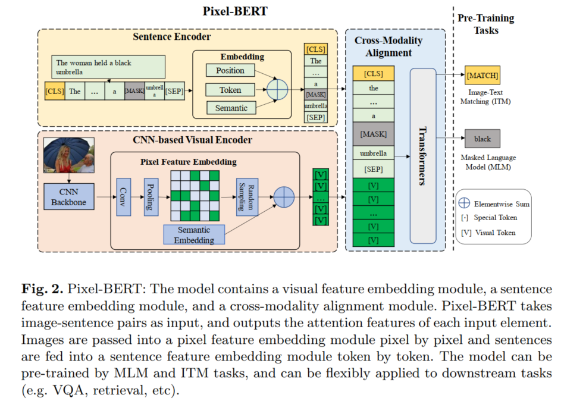

10. **SOHO (CVPR 2021)**

   和Pixel-BERT同一作者，同样不沿用对象识别模型抽取的特征，而是将CNN抽取的特征映射到一个可训练的视觉词典里，三个预训练任务：MLM, ITM以及预测视觉特征在词典里的索引（MVM）

   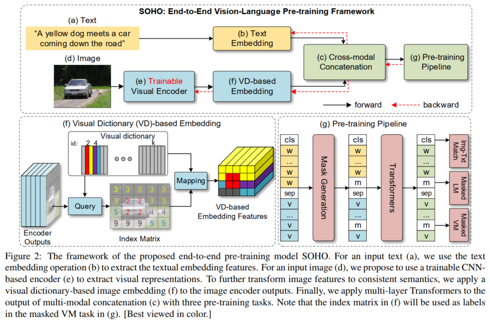

11. **E2E-VLP （ACL 2021）**

   和Pixel-BERT和SOHO一样不沿用对象识别模型抽取的特征，而是用可训练的CNN抽取视觉特征；模型包括encoder和decoder，encoder采用单流结构混合图文特征，decoder一方面做对象识别，一方面做caption生成。

   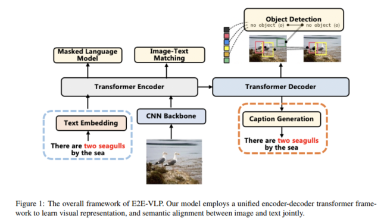

11. **CLIP (ICML 2021)**  from OpenAI

   双流模型，图像端采用ResNet或VIT初始化，文本端采用transformer结构，图文全局特征进行对比学习，基于维基百科高频概念词构建的4亿图文数据

   

11. **ALIGN (ICML2021) from Google**

    双流模型，图像端采用EfficientNet初始化，文本端采用BERT初始化，采用图文全局特征进行对比学习，和CLIP的主要区别在于采用了10亿原始图文数据

    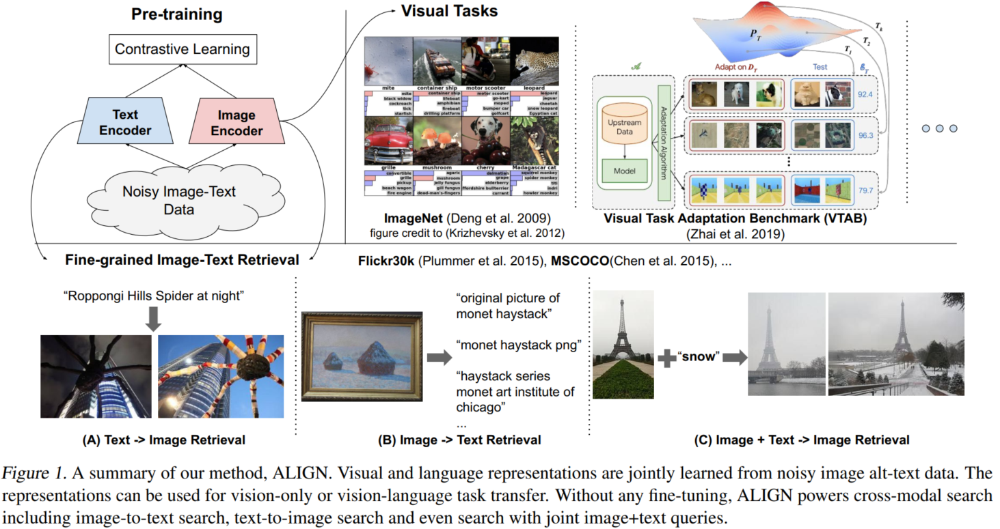

    

12. **ALBEF (NIPS 2021)** from Salesforce

    双流 +单流的结构

    1.双流：**图文各一个编码器**(图像端使用ViT)，并且参考MoCo设置了**两个Momentum Encoder**，预训练任务：ITC (使用图像和文本部分两个CLS token进行对比学习，并且其中一个会用momentum encoder做编码，负例来源于两个队列，而不是batch)

    2.单流：这个单流编码器不同于uniter这类将图文拼接作为输入，而是文本过self-attention，图文混合通过cross-attention，预训练任务：MLM + ITM (**ITM的负例对构建**：在候选队列中根据图文相似度进行sample，相似度越高，选中的概率越大)

    

    为了减少web data的噪音对于图文相关性学习的负面影响（ITM以及ITC中序列中其他样例也可能和正例匹配或者MLM中mask的词也可以替换成非gt的其他词），本文提出将历史模型存成Momentum model，模型除了和gt拟合，也要和Momentum model给出的结果（soft target）拟合, 二者权重0.6:0.4。

    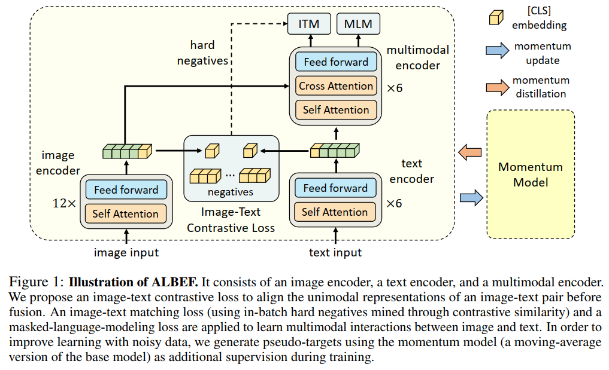

    

13. **BLIP (2022)** from Salesforce

    统一使用transformer的decoder结构做图文匹配和caption生成，预训练任务有三个：

    1）使用bi self attention, 不激活cross-attention layer，进行图文匹配训练；

    2）使用bi self attention, 激活cross-attention layer，进行图文匹配训练 ；

    3）使用casual self attention，激活cross-attention layer, 进行caption的生成。

    CapFilt: 先在弱相关图文数据上做一遍预训练，在MSCOCO上finetune后清理一遍数据再做一次预训练。

    **相比ALBEF**，**模型结构上**，BLIP合并了之前的text encoder和multimodal encoder, 但仍然沿用了momentum encoder和momentum model的策略；**训练策略上**，额外引入了CapFilt减少web data弱相关的影响；训练任务上，将MLM替换成LM，将caption任务加入预训练阶段。

    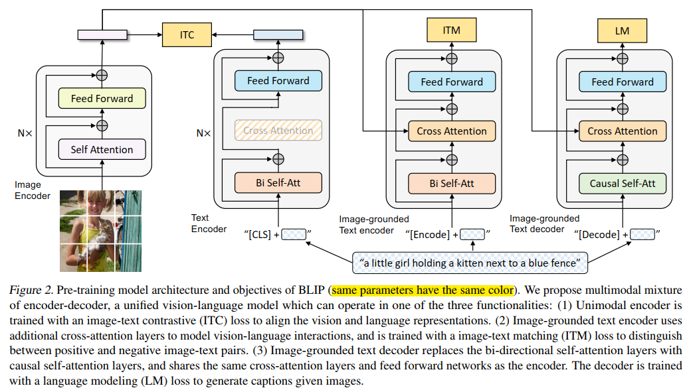

    

14. **VLMO (2021)** from Microsoft

    模型结构：MoME Transformer, 将transformer中单一的FFN换成了单独视觉模态的V-FFN，单独文本模态的L-FFN，混和视觉文本模态的VL-FFN。根据不同类型的输入，选择不同的FFN进行编码，既可以得到单独的模态特征（适合做retrieval），也能得到跨模态特征(适合做图文相关的分类)

    预训练任务：

    第一阶段：只使用图像数据，像BEiT(同一批作者)一样采用mask image modeling进行训练（所有参数）

    第二阶段：只使用文本数据，像BERT一样采用MLM进行训练 **（冻结self-attention layer）**

    第三阶段 ：使用图文数据，使用ITC, ITM和MLM进行训练（全部参数），主要MLM和ITM任务中，**前L-F层激活V-FFN和L-FFN，最后F层才激活VL-FFN。**

    

    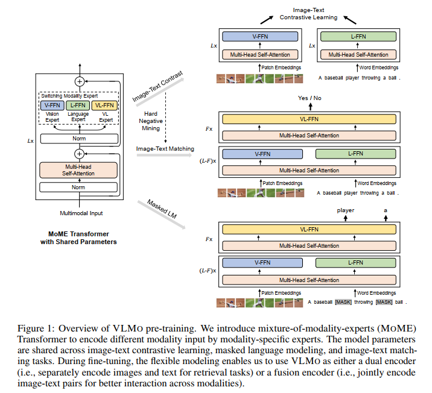

    

15. **M6 (2021)** from Alibaba

    单流结构，采用transformer的encoder做多模态融合。预训练采用**文本生成相关**的一系列任务：1）无图像，输入masked文本，生成完整的文本；2）无图像，无masked文本，生成完整的文本（LM）；3）有图像输入，生成完整的文本；4）有图像，有masked文本，生成完整的文本。

    M6预训练阶段不具备生成文生成图的能力，finetune阶段采用和DALLE一样的做法实现文生成图（M6作为autogressive transformer生成image codes)。

    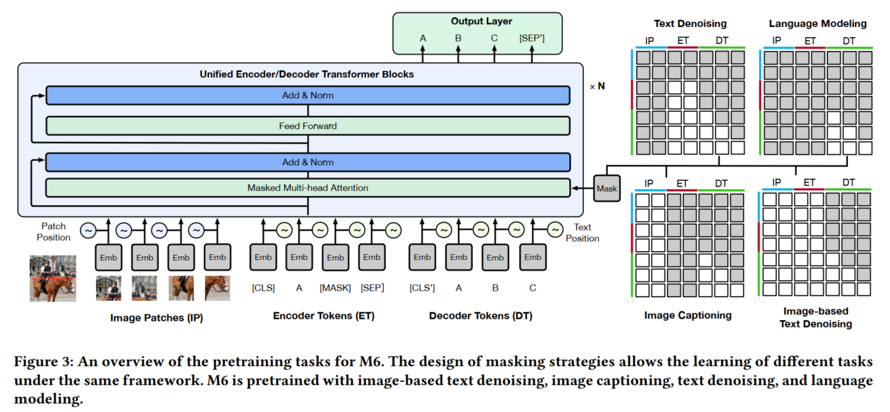

16. **OFA (2022)** from Alibaba

    大一统模型，预训练阶段就采用**encoder-decoder结构**做所有任务（visual grounding, grounded captioning, ITM, image captioning, VQA, detection, image infilling, text infilling）。构建包含词语token, 图像token以及位置token的统一词典。

    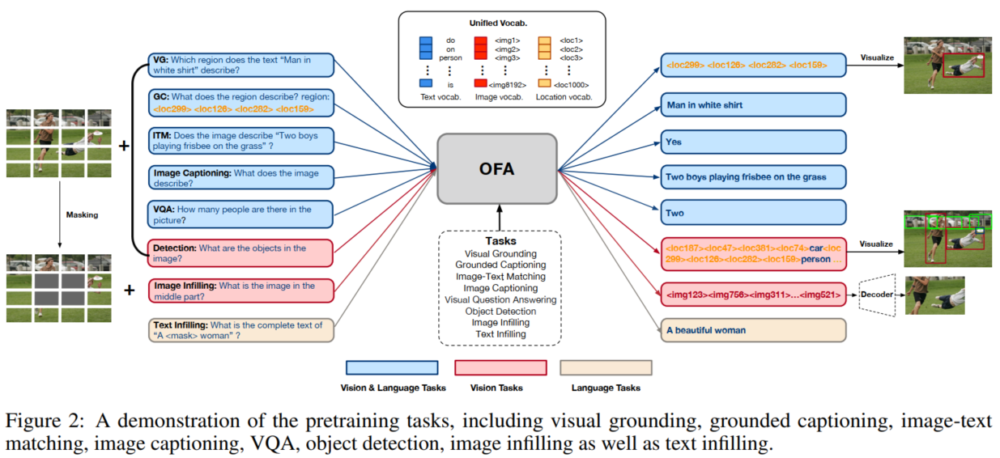

17. **SimVLM (ICLR 2022)** from CMU&Google

    encoder-decoder结构，encoder部分图片和文本会先各自编码，然后混合编码，decoder部分做文本生成

    预训练任务：PrefixLM，即截取文本的前面一部分（加入image 序列）送入编码器，解码生成后续文本

    在弱相关的图文数据集和文本数据集上预训练

    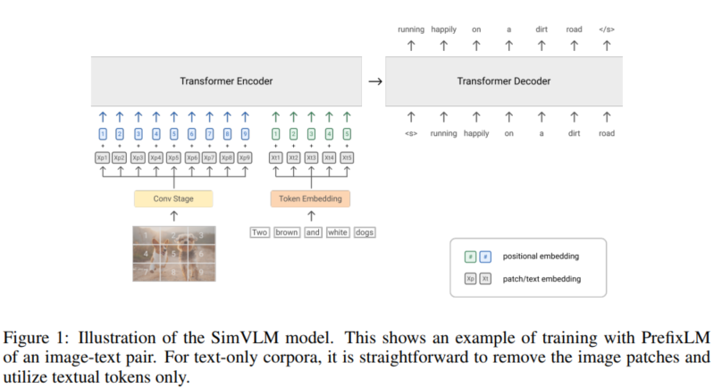

18. **DALL-E (2021)** from OpenAI

    由三部分组成：

    1. dVAE: 编码器将图像的不同区域编码成离散的token embeddings，解码器生成原图片

    2. autogressive transformer：输入文本和图像token 序列，自回归生成 

    3. CLIP：对生成的图片样例进行重排序

       三个部分单独训练，dVAE的训练同时涉及编码器解码器以及token embeddings（codebook）的训练。

       inference阶段即用transformer根据文本生成图像token 序列，然后用dVAE解码器生成图片，再用CLIP进行重排序

       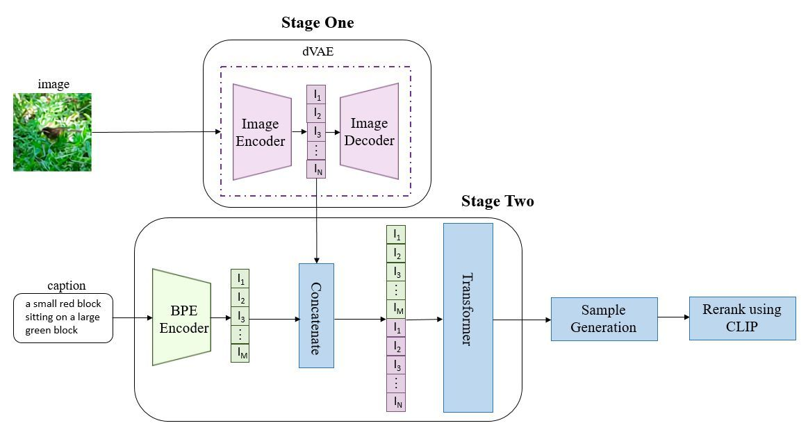

19. **CogView (NIPS 2021)** from Alibaba andTsinghua

    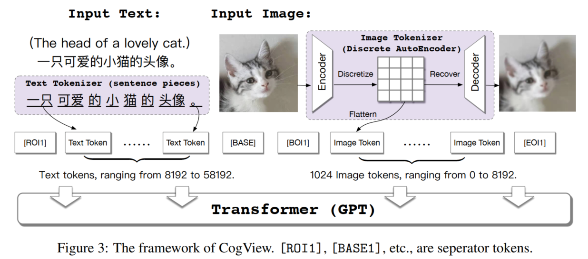

20. **unCLIP (2022)** from OpenAI

    unCLIP也被称为DALLE2，论文取名unCLIP因为它实际上是CLIP的倒转，即利用图像特征生成图片。

    主要由两部分组成：

    1. prior: 根据caption生成图像特征

       尝试了两种形式：将图像特征转成离散的token，自回归生成这些token; 使用Gaussian diffusion model直接生成连续的特征

    2. decoder: 根据图像特征生成图片，采用diffusion model。

    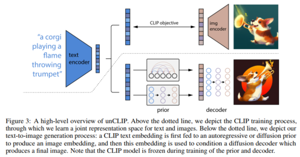

21. **以上模型在coco上caption的效果统计 **(均取论文中最佳，不一定对比公平)

    |  Model   | CIDEr  |
    |  ----  | ----  |
    | Unified VLP (AAAI 2020) | 116.9 |
    | OSCAR (ECCV 2020) | 140.0 |
    | VinVL (CVPR 2021) | 140.9 |
    | XGPT (NLPCC 2021) | 120.1 |
    | E2E-VLP (ACL 2021) | 117.3 |
    | BLIP (2022) | 136.7 |
    | OFA (2022) | 150.2 |
    | SimVLM (2022) | 143.3 |

## 归类整理

### 1.模型结构

- 单流：只用一个cross-modal encoder，如VLBERT(2020), UNITER(2020),  Unified VLP(2020), OSCAR(2020), M6(2021)

- 多流：每个模态用一个encoder，如CLIP(2021), ALIGN(2021)

- 单流多流混合结构：多流+单流，如LXMERT(2019), ViLBERT(2019), Pixel-BERT(2020), SOHO(2021), ALBEF(2021)

- 共享：多种模态可以共享一个encoder，如VLMO(2021)，VATT(2021)

- 编码-解码结构：如E2E-VLP(2021), XGPT(2021), BLIP(2022), OFA(2022)，SimVLM(2022)

  **总结：编码-解码结构是趋势，因为能兼顾各种类型的任务，如图文匹配和文本生成**，**能同时做图文生成的模型很少**

### 2.图片输入形式 

- object region: 
  - 采用预训练好的faster rcnn系列抽取bbox和特征,**非端到端**，如LXMERT(2019), ViLBERT(2019), UNITER(2020), Unified VLP(2020), OSCAR(2020), XGPT(2021)
  - faster rcnn也参与训练，**端到端**，如VLBERT(2020)
  
- patch: 图像切分patch
  - 每个patch用不参与训练的CNN抽特征，**非端到端**，如M6(2021)
  - 每个patch用参与训练的CNN抽特征，**端到端**，如OFA(2022), SimVLM(2022)
  - 每个patch用可训练的线性层抽取特征（即ViT(2020)结构），**端到端**，如CLIP(ViT版本)(2021)，ALBEF(2021)，VLMO(2021), VATT(2021), BLIP(2022)
  
- pixel: 输入整个图片，采用可训练的CNN backbone抽取视觉特征, **端到端**，如Pixel-BERT(2020), SOHO(2021), CLIP(ResNet版本)(2021)，ALIGN(2021),  E2E-VLP(2021), 

  **总结：patch输入，ViT结构是趋势，但是patch大小影响图像细粒度水平**

### 3.预训练任务

...

### 4.预训练数据

- 强相关数据:LXMERT(2019), E2E-VLP(2021), Pixel-BERT(2020), SOHO(2021)

- 弱相关数据:ViLBERT(2019), UnifiedVLP(2020), CLIP(2021), ALIGN(2021), SimVLM(2022) 

- 混合数据: UNITER(2019), OSCAR(2020), XGPT(2021), ALBEF(2021), BLIP(2022), M6(2021), OFA(2022), VLMO(2021)

  **总结：利用海量弱相关数据是必然的，如何从弱相关数据中筛选出强相关信息是趋势**

   
